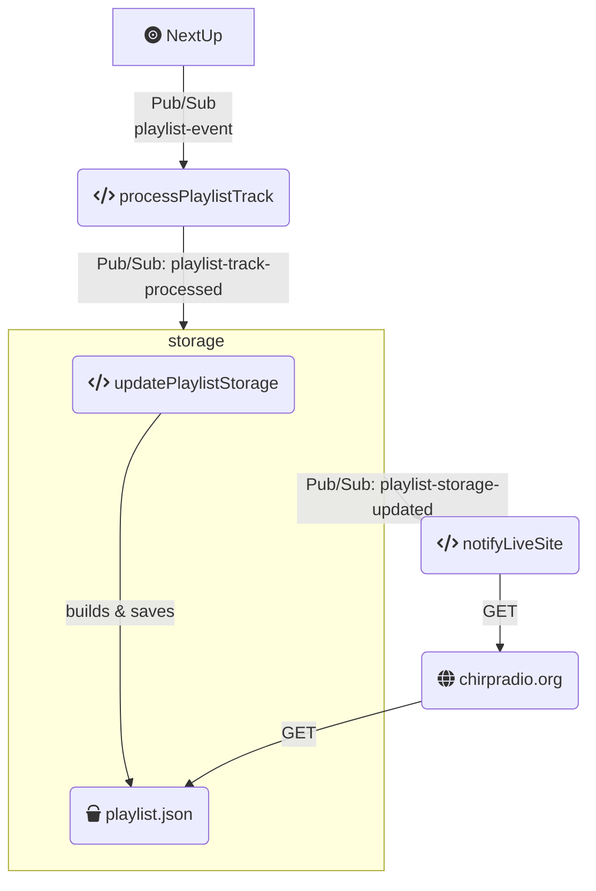

# NextUp

A recording from our 2024 meeting "NextUp Demo and Q&A" can be found in Slack [here](https://chirpdev.slack.com/archives/C01GSPCEDMK/p1706757506383289).

## Playlist pipeline [WIP]
NextUp uses a set of microservices that run as [Cloud Functions](https://cloud.google.com/functions/#documentation) and communicate through [Cloud Pub/Sub](https://cloud.google.com/pubsub/#documentation) messages to enrich freeform tracks with images and let the website and mobile apps know what's playing.

### Topic: "playlist-event"
The NextUp API added a track to the playlist, updated a track on the playlist, or deleted a track from the playlist

#### Message data

| Field Name   | Type            | Description |
|:-------------|:----------------|:------------|
| action       | String          | "added", "updated", or "deleted"  |
| track        | [PlaylistEvent](https://github.com/chirpradio/nextup/blob/develop/app/models/playlistevent.model.js)   | The plain JSON output of the PlaylistEvent entity from the Datastore. Keys *have not* yet been replaced with the related entities they reference (e.g., the `artist` value is a key). |

#### Subscriber(s)
- processPlaylistTrack
  - checks LastFM for images it can add to the PlaylistEvent entity
  - retrieves the details of related objects from the NextUp database for the benefit of later steps in the pipeline
    - album
    - artist
    - track
    - selector (i.e., the DJ)
  - publishes a message to the "playlist-track-processed" topic

### Topic: "playlist-track-processed"
The track data has been enriched and can be used by later steps without querying the Datastore

#### Message data

| Field Name   | Type            | Description |
|:-------------|:----------------|:------------|
| action       | String          | "added", "updated", or "deleted"  |
| track        | [PlaylistEvent](https://github.com/chirpradio/nextup/blob/develop/app/models/playlistevent.model.js)   | The plain JSON output of the PlaylistEvent entity from the Datastore. If the track is added or updated, keys *have* been replaced with the entities they reference (e.g., the `artist` value is an object with details on the artist).  |

#### Subscriber(s)
- updatePlaylistStorage 
  - builds and saves the public JSON feed of recently played tracks to a Cloud Storage bucket
  - publishes a message to the "playlist-storage-updated" topic

### Topic: "playlist-storage-updated"
The JSON feed that lists the track playing now and the five most recently played tracks before it has been updated.

#### Message data
_a passthrough of the "playlist-track-processed" message_

| Field Name   | Type            | Description |
|:-------------|:----------------|:------------|
| action       | String          | "added", "updated", or "deleted"  |
| track        | [PlaylistEvent](https://github.com/chirpradio/nextup/blob/develop/app/models/playlistevent.model.js)   | The plain JSON output of the PlaylistEvent entity from the Datastore. If the track is added or updated, keys *have* been replaced with the entities they reference (e.g., the `artist` value is an object with details on the artist).  |

#### Subscriber(s)
- notifyLiveSite: calls endpoints at chirpradio.org that prompt it to retrieve the latest version of playlist.json from the Cloud Storage bucket
